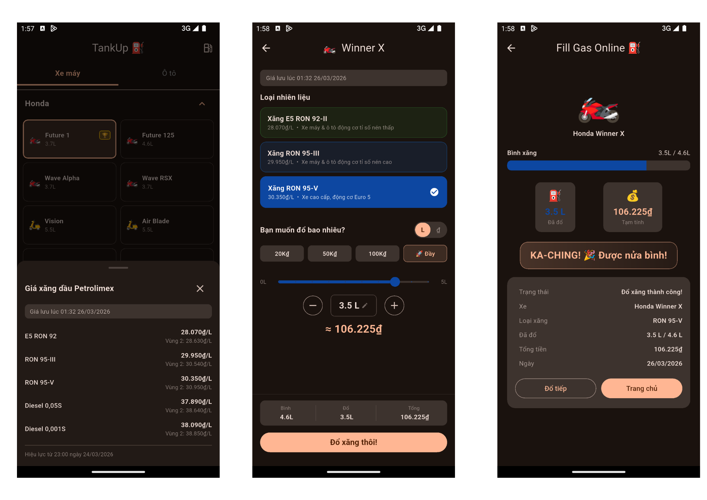

# TankUp - Fill Gas Online

> A funny, interactive app that simulates filling your vehicle with gas or diesel — Vietnamese market edition! 

---

## App Overview

**TankUp** lets users pick their vehicle, choose a fuel type, set how many litres to fill, and watch a satisfying filling animation — all without leaving their couch. Think of it as the Grab of gas stations, minus the actual gas.



---

## Screens

### Disclaimer Screen

Shown **every launch** before the app starts. Informs the user that:

- Fuel prices are sourced from an **unofficial** channel
- Data is for reference only and may not be accurate
- The app is **for fun only** — not for financial decisions
- The developer takes **no responsibility** for any decisions made based on app data

Users must choose **Thoát** (exit) or **Tiếp tục** (continue) — the back button is disabled.

---

### Screen 1 — Select Vehicle

- Tab switcher: **🏍️ Xe máy** | ** Ô tô**
- Vehicles grouped by brand inside collapsible `ExpansionTile` sections
- Each card shows: emoji, name, tank capacity (or EV)
- Legacy vehicles (`isLegacy: true`) display a 🏆 gold badge
- **Top-right icon** (`⛽`) opens a bottom sheet with live Petrolimex fuel prices (Vùng 1 + Vùng 2) and source badge
- Bottom bar shows selected vehicle; **"Tiếp theo →"** proceeds to Screen 2

### Screen 2 — Choose Fuel & Amount

- **Live price badge** (top of screen):
  - ` Đang tải giá...` while fetching
  - ` Giá cập nhật lúc HH:MM DD/MM/YYYY` — live from webgia.com
  - ` Giá lưu lúc ...` — from SharedPreferences cache
  - ` Đang dùng giá tạm thời` — hardcoded fallback

- **Fuel type cards** auto-filtered by vehicle's `fuelGrades` (shows all accepted grades):

| Fuel ID | Vietnamese Name |
|---|---|
| `e5_ron92` | Xăng E5 RON 92-II |
| `ron95_iii` | Xăng RON 95-III |
| `ron95_v` | Xăng RON 95-V |
| `diesel_005s` | Dầu Diesel DO 0,05S-II |
| `diesel_0001s` | Dầu Diesel DO 0,001S-V |
| `electric` | Điện (EV) |

Vehicles with `fuelGrades: [ron92, ron95]` see 3 petrol options (E5 RON 92 + RON 95-III + RON 95-V).

#### Fill Amount Input (L ↔ ₫ mode toggle)

```
┌─────────────────────────────────────────┐
│  Bạn muốn đổ bao nhiêu?                 │
│                                         │
│           [ L ]  ↔  [ ₫ ]               │  ← Mode toggle
│                                         │
│  Motorbike: [ 20K₫ ] [ 50K₫ ] [ 100K₫ ] │
│  Car:       [200K₫ ] [500K₫ ] [  1 Triệu]  ← Vehicle-type presets
│                           [🚀 Đầy]      │
│                                         │
│  ────●──────────────────  3.5 L         │  ← Slider (0.5L steps)
│                                         │
│  [ − ]   3.5 L     (tap to type)  [ + ] │  ← Manual +/− + type-in
│                                         │
│  ≈ 98.245₫                              │  ← Live price preview
└─────────────────────────────────────────┘
```

- **Mode toggle `L ↔ ₫`**: both directions stay in sync using live price
- **Quick presets**: typed `FuelPreset` enum — motorbike `20K/50K/100K`, car `200K/500K/1M`, `🚀 Đầy` for full tank
- **Slider**: draggable, 0.5L step, capped at `tankCapacity`
- **+/− stepper**: 0.5L per tap; tap value label to type a number
- For VinFast EVs: **battery % slider** instead of litre controls

- **Sticky bottom summary bar:**
  ```
  Bình: 4.6L  |  Đổ: 3.5L  |  Tổng: 98.245₫
  ```

### Screen 3 — Filling Animation

- 5-phase animation: INSERTING → FILLING → COMPLETE → RESULT
- Live counters ticking up (litres / VND)
- Context-aware completion message based on fill %:
  - ≥ 100% → `"Đầy bình rồi!"`
  - ≥ 80% → `"Gần đầy rồi!"`
  - ≥ 50% → `"Được nửa bình!"`
  - ≥ 20% → `"Xong rồi!"`
  - < 20% → `"Chút xíu nhưng được rồi!"`
  - EV → `"Sạc xong! Xanh lắm bạn ơi!"`
- **"Đổ tiếp"** → back to Screen 1 | **"Trang chủ"** → back to Screen 1

---

##  Supported Vehicles

### Motorbikes (Xe máy)

| Brand | Models |
|---|---|
| Honda | Future 1 *(🏆 2001 legacy)*, Future 125, Wave Alpha, Wave RSX, Vision, Air Blade, SH 125i, Lead 125, Winner X |
| Yamaha | Sirius, Exciter 155, Janus, NVX 155, Grande, FreeGo |
| Suzuki | Raider R150, Address |
| SYM | Attila Elizabeth, Star SR |

Multi-grade bikes (`[ron92, ron95]`): Future 125, Vision, Air Blade, Lead 125, Janus, Grande, FreeGo, Address, Attila Elizabeth, Star SR

### Cars (Ô tô)

| Brand | Models |
|---|---|
| Toyota | Vios, Corolla Cross, Innova Cross, Fortuner *(diesel)*, Raize |
| Honda | City, Civic, HR-V, CR-V, Accord *(hybrid)* |
| Hyundai | Accent, Creta, Tucson, Santa Fe |
| Kia | Morning, Seltos, Sorento |
| Mazda | Mazda2, CX-5, CX-8 |
| Mitsubishi | Xpander, Xforce, Outlander |
| Ford | Territory, Everest *(diesel)*, Ranger *(diesel)* |
| VinFast ⚡ | VF 3, VF 5, VF 6, VF 7 *(EV — battery slider)* |

Multi-grade cars (`[ron92, ron95]`): Raize, Accent, Morning, Xpander

---

## Getting Started

```bash
flutter pub get
flutter run

# Release build
flutter build apk --release
flutter build ipa --release
```
---

Built with ❤️ and a lot of ⛽ in Vietnam 🇻🇳

---